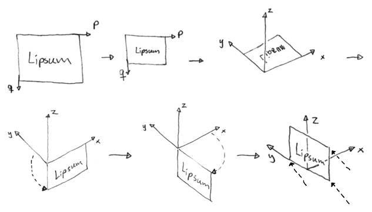

# 3.1 - Camera non-calibration

The EOS scanner is a pushbroom scanner with perpendicular scanners for $x$ and $y$ axes, both moving along the $z$ axis. This notebook outlines outlines the non-calibration procedure. No point cloud is used.

An outline of the *frontal* pushbroom image acquisition setup is shown in the image below.

The source and detector moves along the $z$-axis. The detectors's position at time $t$ is given as $(313, 0, z(t))$, however **the image is scaled on the horizontal axis** to remove the pushbroom's mixed orthogonal-perspective projection look; thus making it look like the detector's position is actually $(0, 0, z(t))$.

The source's position at time $t$ is given as $(-987, 0, z(t))$ where the first value is provided in the DICOM file headers. This value is -987 mm for the frontal projection and -918 mm (verify!) for the lateral projection.

## Relation between pixel coordinate $(p,q)$ and world coordinate $(x,y,z)$

Given a set of image pixel coordinates $P = (p,q)^\top$ on the **frontal image**, where $p$ denotes the first image axis (perspective projected, horizontal axis) and $u$ denotes the second image axis (orthogonal projected, vertical axis) with the origin in the top left corner, first axis pointing right and second axis pointing down (as is custom for 2d computer graphics), we apply the following set of affine transformations:

* Scale image from pixel to mm
* Extend coordinate set by two dimensions to get $(x,y,0,1)$
* Rotate -90° around $x$ and $z$ axes
* Translate image along $y$ by half its width and along $z$ by its height

The series of transformations is shown in the sketch below.

The transformation matrix that performes the series of transformations above relates pixel coordinate $(p,q)$ to homogeneous world coordinate $(x,y,z,w)$, where $x = 0$ for the frontal projection described here.

For the **lateral image**, the series of affine transformation is:

* Scale image from pixel to mm
* Extend coordinate set by two dimensions to get $(x,y,0,1)$
* Rotate -90° around $x$ axis
* Translate image along $-x$ by half its width and along $z$ by its height

## Epipolar(?) lines

Given a world coordinate $a_i = (x_i,y_i,z_i)$ for a corresponding point of interest $i$ on the frontal image (where $x=0$ by convention), another point on the corresponding epipolar line is given as $b_i = (-987, 0, z_i)$ as $z_{source}(t) = z_{detector}(t)$. A point $r_i$ along the epipolar line of point $i$ can thus be described as $r_i = a_i + \lambda (b_i - a_i)$.
